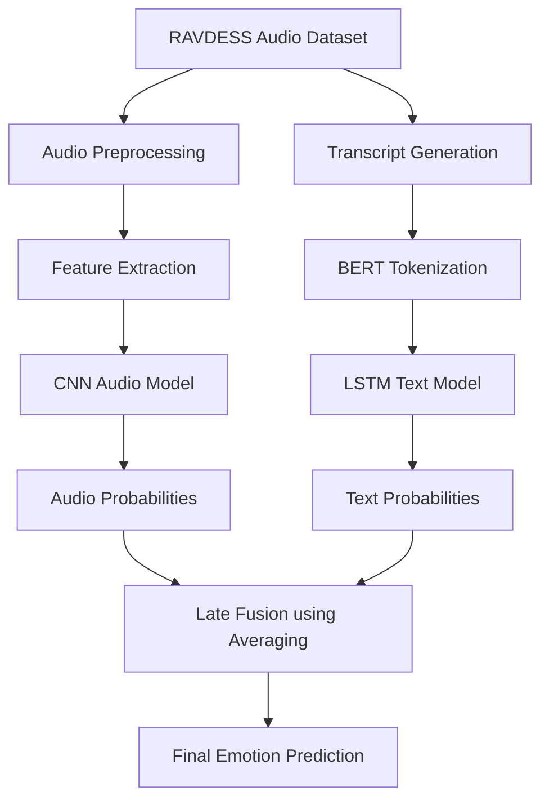

# Multimodal Emotion Recognition Report

## Project Overview

This project implements a **multimodal emotion recognition system** using:

1. Audio-based (spectrogram) CNN model for speech emotion recognition
2. Text-based LSTM model for transcript emotion recognition
3. Multimodal fusion model combining both modalities

The dataset used is the RAVDESS speech audio dataset.

The primary goal was to compare the effectiveness of:

- Audio-only learning
- Text-only learning
- Multimodal fusion

---

## NOTE:

Whisper was initially imported and tested using the `base` model to generate transcripts. Testing began with 10 files, then 100, then 500. Up to 500 files it worked reasonably well, but the full RAVDESS dataset contains 1440 samples, which required significant computational power and caused several runtime interruptions.
Since the dataset only contains two repeated sentences across all clips, I instead chose to hardcode the transcripts by identifying which sentence corresponded to each filename. This approach was instantaneous, exact, and allowed me to move forward, which I wasn't able to do previously.

---

# System Architecture

## Multimodal Chart

---

# Architectural Design Decisions

## Audio CNN Model

A 2D CNN-based architecture was used to learn emotional patterns from extracted audio features.

### CNN Architecture

- Multiple `Conv2D` layers
- ReLU activations
- Dropout for regularization
- Dense classification layers
- Softmax output for 8 emotion classes

### Extracted Features

The audio pipeline extracted the audio file, then padded it, normalized it and then also extracted its spectrogram for conv2d filtering.

---

## Text LSTM Model

- BERT tokenizer (`bert-base-uncased`)
- Embedding layer
- Bidirectional LSTM
- Dense classifier

---

## Multimodal Fusion

The multimodal system combines prediction probabilities from:

- Audio CNN
- Text BiLSTM

Late fusion was selected because:

- Audio and text models can be trained independently
- Easier debugging
- Robust even if one modality underperforms
- Simpler implementation compared to early fusion

---

# Model Architectures

## CNN Audio Model Summary

| Layer                | Purpose                            |
| -------------------- | ---------------------------------- |
| Conv2D (64 filters)  | Learn low-level acoustic patterns  |
| Conv2D (128 filters) | Learn higher-level speech features |
| Conv2D (128 filters) | Deeper feature extraction          |
| Conv2D (256 filters) | Complex emotional representation   |
| Dropout              | Reduce overfitting                 |
| Flatten              | Convert to dense representation    |
| Dense (256)          | Classification learning            |
| Dropout              | Reduce overfitting                 |
| Dense (128)          | Classification learning            |
| Dropout              | Reduce overfitting                 |
| Softmax Output       | Emotion prediction                 |

**Things that could be improved:**
- BatchNormalization layers can be added in order to normalize while filtering. 

A larger model using smaller progressive filters was tested earlier, but it produced significantly lower accuracy. Increasing dropout from 0.1 to 0.3 helped reduce overfitting and improved validation performance. Four Conv2D layers provided the best balance between feature extraction and model complexity.

---

## Text LSTM Model Summary

| Layer              | Purpose                    |
| ------------------ | -------------------------- |
| Embedding Layer    | Word vector representation |
| Bidirectional LSTM | Context understanding      |
| Dense Layer        | Feature compression        |
| Dropout            | Regularization             |
| Softmax Output     | Emotion classification     |

The text model was intentionally kept lightweight because the transcript information in the dataset was pretty useless.

---

# Training

## CNN Training

- Epochs: 50 
- Batch size: 32
- Optimizer: Adam
- Loss function: Sparse categorical crossentropy

25 epochs with a batch size of 64 was used before, but after tinkering this turned out to give the best accuracy.

## RNN Training

- Epochs: 25
- Batch size: 32
- Optimizer: Adam
- Loss function: Sparse categorical crossentropy

---

# Training and Validation Loss Plots

1. CNN training vs validation loss and accuracy curves

    

2. RNN training vs validation loss and accuracy curves

    

3. Confusion matrix for final prediction

---

# Results Table

## Model Performance Comparison

| Model Type        | Accuracy | Macro F1-Score | Notes                                          |
| ----------------- | -------- | -------------- | ---------------------------------------------- |
| Audio CNN         | 54.55%      | 0.50           | Best performing standalone model               |
| Text LSTM         | 10.71%      | 0.02           | Failed to generalize effectively               |
| Multimodal Fusion | 54.55%      | 0.50           | Similar to audio model due to weak text branch |

---

# Challenges Encountered

## Audio Challenges

- Emotional overlap between similar classes
- The dataset had a significantly larger number of neutral samples compared to other emotions, requiring undersampling to maintain class balance
- Neutral emotion is difficult to distinguish and classify accurately
- Dataset size limitations
- Moderate overfitting during training

## Text Challenges

- Weak transcript representation
- Lack of expressive semantic diversity since only two sentences were used across all audio clips

---

# Confusion Matrix Analysis

The confusion matrix showed strong performance on calm and angry emotions, while emotions such as disgust and fear were more frequently misclassified. This suggests that some emotional categories shared overlapping vocal characteristics.

---

# Final Performance Summary

| System            | Final Accuracy |
| ----------------- | -------------- |
| CNN Audio Model   | 54.55%         |
| LSTM Text Model   | 10.71%         |
| Multimodal Fusion | 54.55%         |

The fusion model achieved approximately the same accuracy as the audio model, indicating that the text modality contributed minimal useful information compared to the audio features.

