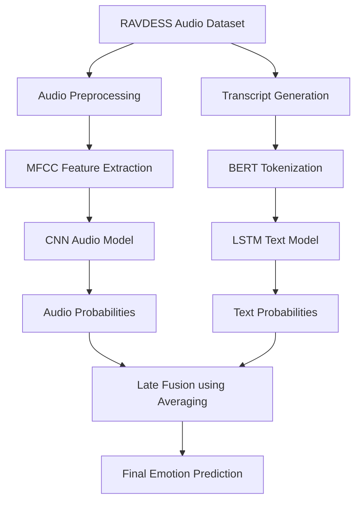
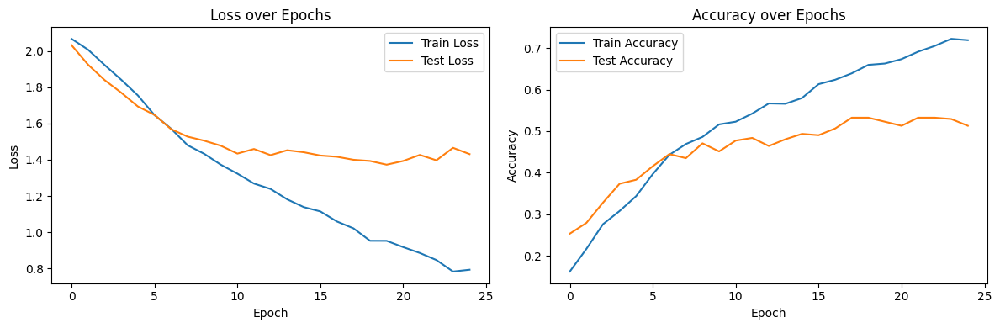
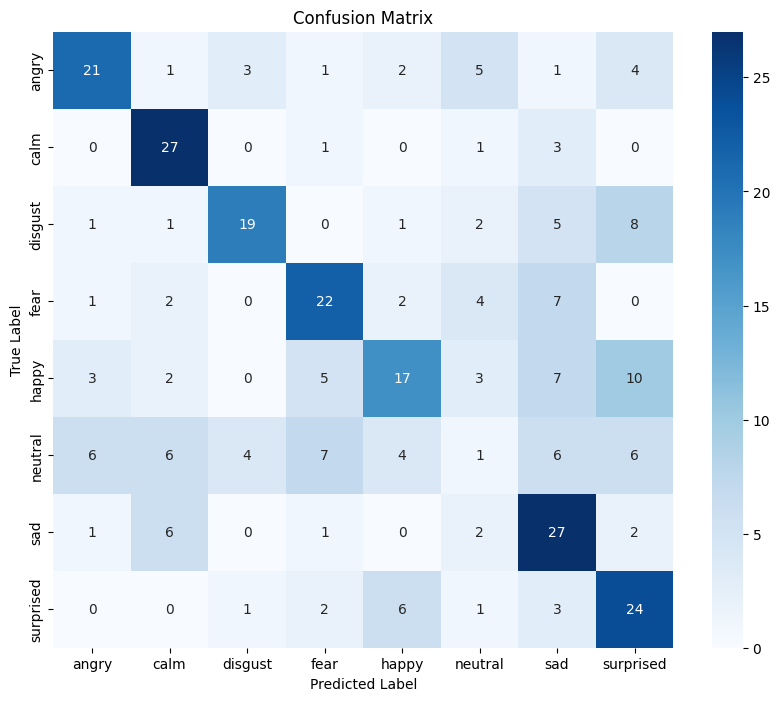
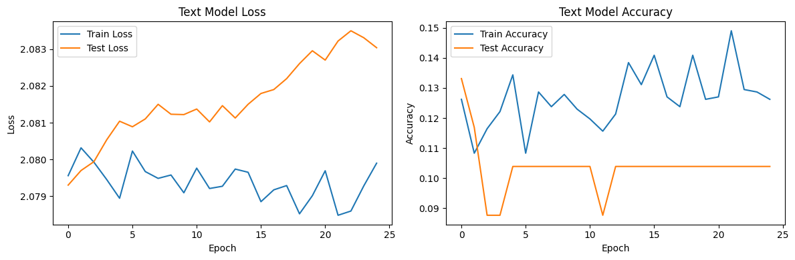
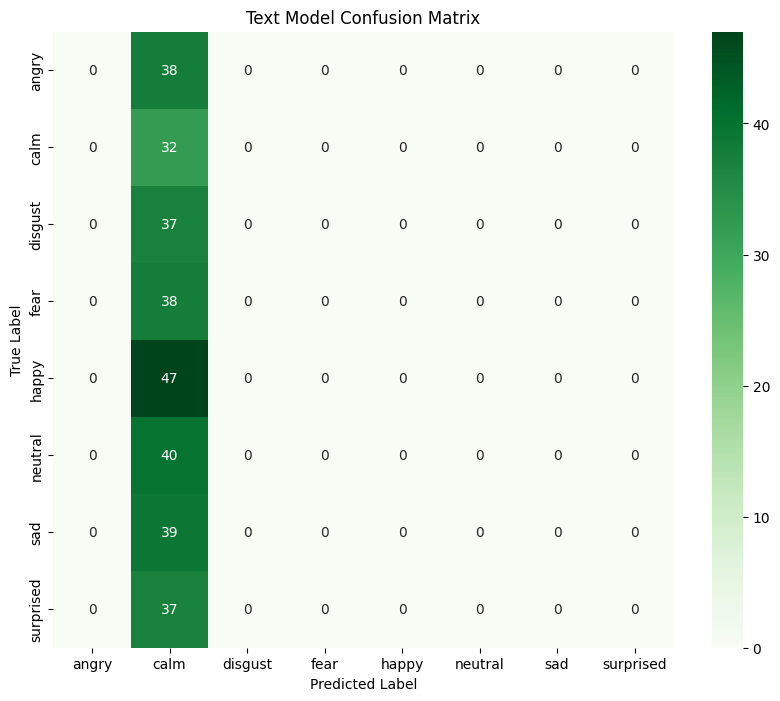
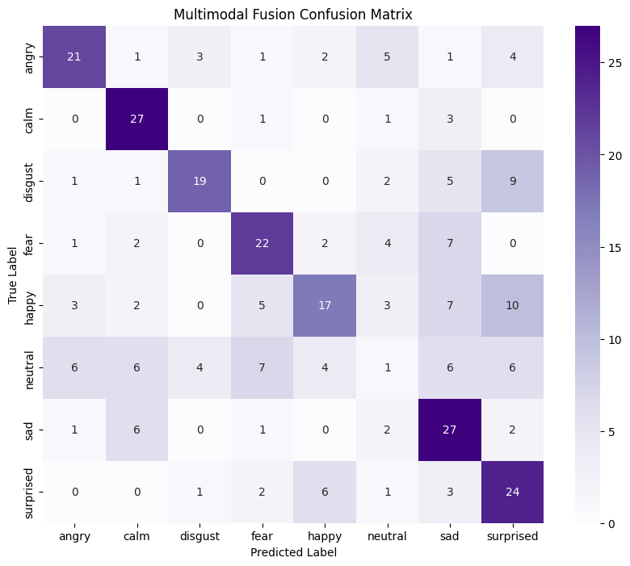

# Multimodal Emotion Recognition Report

## Project Overview

This project implements a **multimodal emotion recognition system** using:

1. Audio-based CNN model for speech emotion recognition
2. Text-based BiLSTM model for transcript emotion recognition
3. Multimodal fusion model combining both modalities

The dataset used is the RAVDESS speech audio dataset

The primary goal was to compare the effectiveness of:
- Audio-only learning
- Text-only learning
- Multimodal fusion

---

## NOTE: 
Whisper was imported, and then used to load the dataset (using the 'base' model), starting with 10 files at first, then 100, then 500. Till 500 it was able to do it comfortably and fairly fast. However, this dataset uses 1440 samples. So loading it required huge amounts of computational power which caused the program to just stop running at times. Since this audio dataset has only 2 sentences over all its clips, I instead chose to hardcode the transcripts by finding out which sentence was said in which file (you can tell by looking at the name of the file). This strategy, although did not use whisper, was instantaneous and exact. I made this decision in order to effectively run the program, since previously I wasn't able to move forward.

# System Architecture

## Multimodal Chart

---

# Architectural Design Decisions

## Audio CNN Model

A 1D CNN architecture was used because speech features such as MFCCs contain local temporal patterns that convolutional layers can efficiently learn.

### CNN Architecture

- Multiple `Conv1D` layers
- ReLU activations
- Dropout for regularization
- Dense classification layers
- Softmax output for 8 emotion classes

### Extracted Features

The audio pipeline extracted:
- MFCC coefficients
- Mean pooled spectral representations

---

## Text BiLSTM Model

- BERT tokenizer (`bert-base-uncased`)
- Embedding layer
- Bidirectional LSTM
- Dense classifier

---

## Multimodal Fusion

The multimodal system combines prediction probabilities from:

- Audio CNN
- Text BiLSTM

Late fusion was selected because:
- Audio and text models can be trained independently
- Easier debugging
- Robust even if one modality underperforms
- Simpler implementation compared to early fusion

---

# Model Architectures

## CNN Audio Model Summary

| Layer | Purpose |
|---|---|
| Conv1D (64 filters) | Learn low-level acoustic patterns |
| Conv1D (128 filters) | Learn higher-level speech features |
| Conv1D (128 filters) | Deeper feature extraction |
| Conv1D (256 filters) | Complex emotional representation |
| Dropout | Reduce overfitting |
| Flatten | Convert to dense representation |
| Dense (256) | Classification learning |
| Dropout | Reduce overfitting |
| Dense (128) | Classification learning |
| Dropout | Reduce overfitting |
| Softmax Output | Emotion prediction |

A larger model with 16->32->64->128 was used earlier, as seen commented out in the code, but it didn't prove very effective and only gave around a 20% accuracy.
Dropout was also increased to 0.3 from 0.1 in order to reduce overfitting, increasing the accuracy dramatically. 4 Conv1D layers did the job pretty well so that's where I left it. Also added 3 dense layers instead of 2, and it increased accuracy from around 35 to 40. 

---

## Text LSTM Model Summary

| Layer | Purpose |
|---|---|
| Embedding Layer | Word vector representation |
| Bidirectional LSTM | Context understanding |
| Dense Layer | Feature compression |
| Dropout | Regularization |
| Softmax Output | Emotion classification |

I kept the lstm model pretty basic since the text model wasn't doing much anyway.

---

# Training 

## CNN and RNN Training

- Epochs: 25
- Batch size: 32
- Optimizer: Adam
- Loss function: Sparse categorical crossentropy

---

# Training and Validation Loss Plots

1. CNN training vs validation loss and accuracy curves

      

2. RNN training vs validation loss and accuracy curves

    

3. Confusion matrix for final prediction

---

# 8. Results Table

## Model Performance Comparison

| Model Type | Accuracy | Macro F1-Score | Notes |
|---|---|---|---|
| Audio CNN | 51.30% | 0.50 | Best performing standalone model |
| Text LSTM | 10.39% | 0.02 | Failed to generalize effectively |
| Multimodal Fusion | 51.30% | 0.50 | Similar to audio model due to weak text branch |

---

# Challenges Encountered

## Audio Challenges

- Emotional overlap between similar classes
- The dataset had 1536 neutral samples, and only 192 of every other emotion. This required undersampling of the neutral emotion to 192 to keep everything even. (could've used class weights as well, but this approach just required an exact, direct implementation of 3 lines so that's what I did) 
- Neutral emotion is difficult to distinguish and therefore classify
- Dataset size limitations

## Text Challenges

- Weak transcript representation
- Lack of expressive semantic diversity - only 2 sentences were used over all audio files

---

# Final Performance Summary

| System | Final Accuracy |
|---|---|
| CNN Audio Model | 51.30% |
| LSTM Text Model | 10.39% |
| Multimodal Fusion | 51.30% |

The fusion model achieved approximately the same accuracy as the audio model meaning that the text modality contributed minimal useful information
 